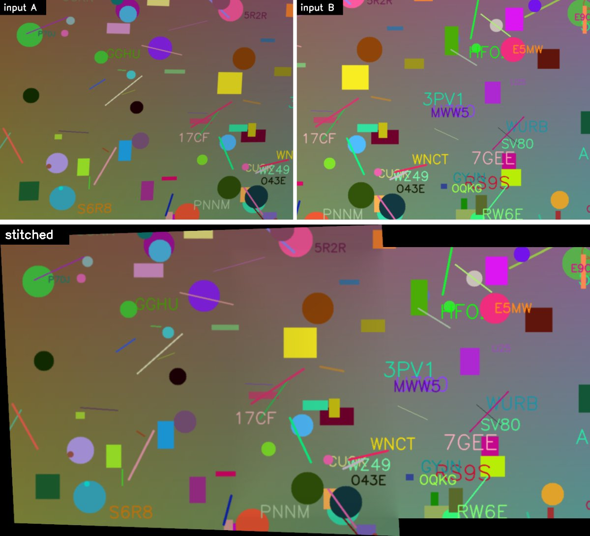

# Panorama Stitching

[](https://github.com/GabeMed/panorama-stitching/actions/workflows/ci.yml)

Panorama stitching pipeline that combines two overlapping photographs into a single seamless image. The homography estimation (DLT + RANSAC) is implemented from scratch using NumPy; OpenCV handles feature detection (SIFT), perspective warping, and image I/O.

## Result



The test scene above is synthetic. It is rendered by `src/synthetic.py`, so it has a known ground-truth homography. Image B is a crop of the scene. Image A is a perspective view of the left part at 85% exposure, which simulates a rotated camera with different exposure. On this pair:

| | Value |
|---|---:|
| Ratio-test matches | 214 |
| RANSAC inliers (this repo) | 187 |
| Mean corner error vs ground truth, this repo's DLT + RANSAC | 1.93 px |
| Mean corner error vs ground truth, `cv2.findHomography(..., RANSAC, 5.0)` on the same matches | 1.20 px |

Corner error is the mean distance between image A's four corners mapped by the estimated homography and by the true one. Regenerate the figure and numbers with `uv run python src/synthetic.py assets`.

## How It Works

1. **Feature Detection & Matching**: SIFT keypoints are detected in both images and matched via brute-force with Lowe's ratio test to filter ambiguous correspondences.
2. **Homography Estimation**: A 3x3 homography matrix is computed from scratch using the Direct Linear Transform (DLT) with Hartley point normalization, wrapped in RANSAC (2000 iterations, 5px threshold) to reject outlier matches.
3. **Warping**: Image A is warped into image B's coordinate frame via the homography. A canvas is computed to fit both images, with translation offsets to handle negative coordinates.
4. **Blending**: The overlap region is blended using distance-weighted averaging (`cv2.distanceTransform`), producing a smooth seam instead of a hard cut.

## Project Structure

```
panorama-stitching/
├── src/
│   ├── main.py          # orchestrator + CLI entry point
│   ├── features.py      # SIFT detection + BFMatcher + Lowe's ratio test
│   ├── homography.py    # point normalization, DLT, RANSAC (from scratch)
│   ├── warping.py       # perspective warp + canvas computation
│   ├── blending/
│   │   ├── __init__.py
│   │   └── simple.py    # distance-weighted blending
│   └── synthetic.py     # synthetic scene with known homography (tests + demo figure)
├── tests/               # pytest suite
├── assets/              # README figure
├── pyproject.toml
├── uv.lock              # pinned environment
└── report_briefing.md   # longer technical write-up
```

## Prerequisites

- [uv](https://docs.astral.sh/uv/) (install with `brew install uv`). uv installs Python 3.13 and the locked dependencies from `uv.lock` on first run.

## Usage

Run from the repository root:

```bash
uv run python src/main.py <image_a> <image_b> [output_path]
```

`output_path` defaults to `panorama_result.jpg` if omitted. Image A is warped into image B's frame.

### Example

On a pair of private photos (kept out of the repo in `src/data/`, which is gitignored):

```bash
uv run python src/main.py "src/data/left.jpg" "src/data/right.jpg" panorama_result.jpg
```

Output:

```
[features]   248 good matches found
[homography] 105 inliers out of 248 matches
[warping]    canvas size 2240x2027, offset (0, 187)
[done]       saved to panorama_result.jpg
```

RANSAC sampling is random. For repeatable output from Python, pass a generator: `stitch(img_a, img_b, rng=np.random.default_rng(0))`.

## Tests

```bash
uv run pytest        # 24 tests, about 2 s
uv run ruff check .
```

- **DLT:** recovers a known homography to machine precision from exact correspondences, including the minimal 4-point case. Hartley normalization gives zero centroid and mean radius √2. Under 0.5 px noise the error stays sub-pixel.
- **RANSAC:** keeps sub-pixel accuracy and the right inlier set with 30%, 50% and 60% injected outliers. A companion test shows that plain DLT breaks on the same data. RANSAC is also reproducible with a seed, skips degenerate collinear samples, and rejects fewer than 4 points.
- **Warping and blending:** canvas size and offset for a known translation; overlap masks; a monotonic blend ramp across the overlap; border cropping.
- **End to end:** SIFT matches on the synthetic pair agree with the ground truth. The estimated homography is within 3 px corner error and close to OpenCV's. `stitch` produces a panorama of the expected size and fails clearly when there are too few matches.

GitHub Actions runs `uv sync --locked`, ruff and pytest on every push to `main` and every pull request.

## Dependencies

Managed by uv via `pyproject.toml` and pinned in `uv.lock`:

- **numpy**: linear algebra (SVD, matrix operations)
- **opencv-python**: SIFT, BFMatcher, warpPerspective, distanceTransform, image I/O
- dev: **pytest**, **ruff**
